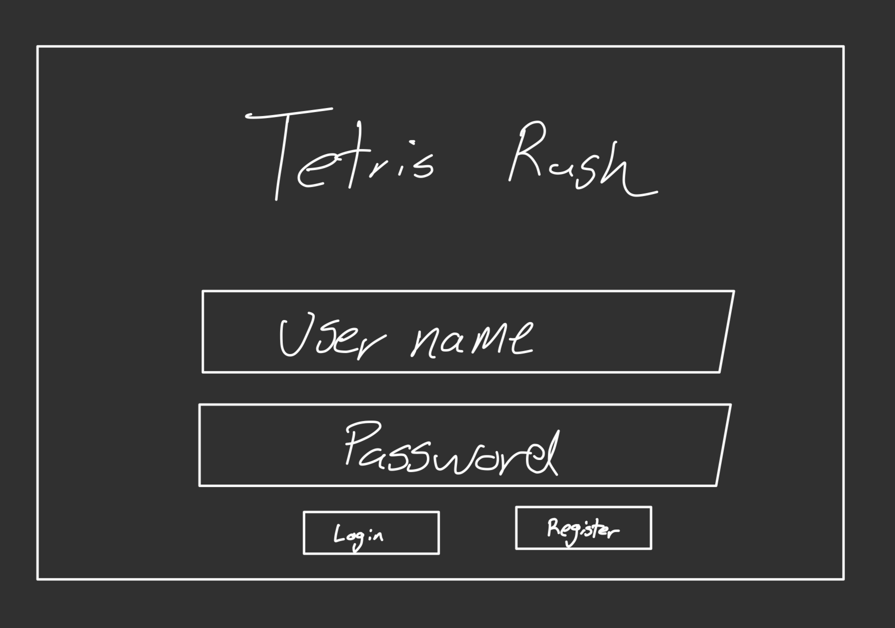
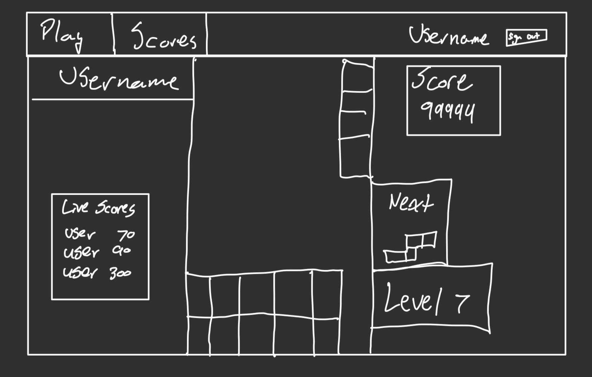
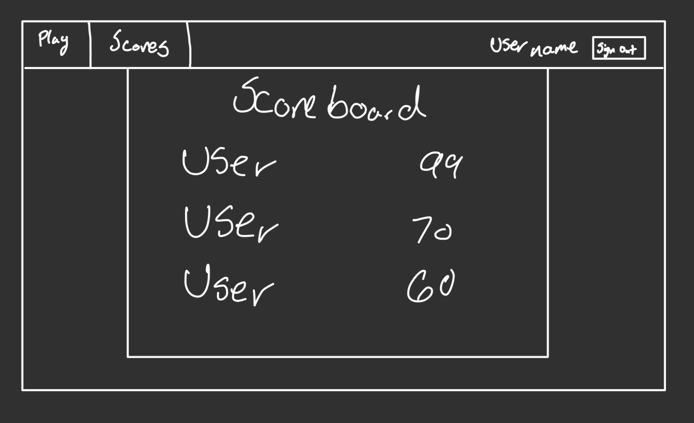
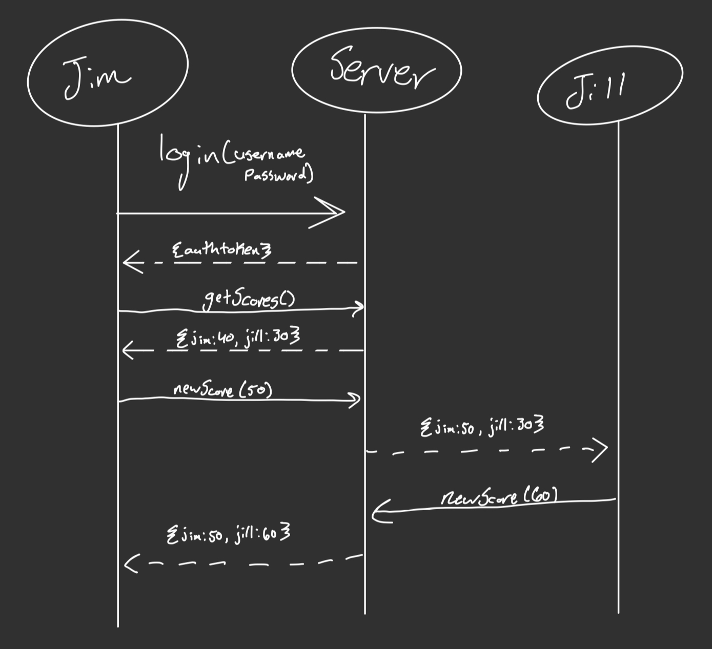

# Tetris Rush
Let it be known I wanted to use Typescript

## Description deliverable

### Elevator Pitch

Have you ever gotten into an argument with friends, family, or even strangers about who is the best at Tetris? Argue no more, as Tetris Rush is here to solve all of your problems. Tetris Rush is a multiplayer Tetris game that allows you to play against your friends and family to see who is the best at Tetris in an asynchronous way. As you are playing, you can see the score tally of all other players update in real time to see who is in the lead. Tetris Rush is a fun and competitive way to play Tetris with your friends and family. Once everyone has finished playing, you can see the final scores of all players and see who is the best at Tetris.

### Design

Here is a sequence diagram that shows how players would interact with the backend

### Key Features

- Secure login over HTTPS
- Real time score updates
- Leaderboard to see who is the best at Tetris
- Results persist between sessions
- Responsive design that works on mobile and desktop
- Scores locked to prevent cheating, verified by backend

### Technologies

- **HTML** - Uses correct HTML structure for application. Three pages, one for login, one for gameplay, and one for leader board.
- **CSS** - Application styling that looks good on different screen sizes, uses `@media` queries to adjust styling for different screen sizes. Following proper CSS conventions and contrast ratios.
- **JavaScript** - Provides login, gameplay, and leader board functionality. Uses `fetch` to communicate with backend. Manages the canvas for gameplay.
- **Service** - Backend service with endpoints for:
  - login
  - retrieving scores
  - submitting new scores
  - retrieving game state
- **DB/Login** - Store users, scores in database. Register and login users. Credentials securely stored in database. Can't play game without logging in.
- **WebSocket** - As each user plays the game, their score is updated in real time for all other users. When all users have finished playing, the game ends and the final scores are displayed.
- **React** - Application ported to React. Uses React Router to navigate between pages. Uses React Hooks to manage state. Uses React Context to manage global state.

### HTML Deliverables

For this deliverable I scaffolded the structure of my application in HTML

- [x] HTML Pages - I have 4 pages, one for login, one for gameplay, one for the leaderboard, and one about page
- [x] Links - The Login page automatically links to the gameplay page when you login, and all pages link to each other via the navbar
- [x] Text - All pages have text that is relevant to the page, for example the about page explains what the application is, and how it is used. The game play page has text telling about the scores, etc.
- [x] Images - The about page has a header image of a tetris game
- [x] Use Name Display - The logged in user is displayed in the Navbar next to a logout button
- [x] DB/Login - The login page has a input box for username and password for login. The scoreboard and live scores represent data being pulled from the database.
- [x] Websocket - The live scores are updated in real time using websockets

### CSS Deliverables

- [x] Styled Header, footer and main content - The header, footer, and main content are all styled with CSS
- [x] Navigation Elements - The navigation elements are styled with CSS, and change color when hovered over, as well as when the selected page is active
- [x] Responsive Design - The application is responsive and works on mobile and desktop. The navbar collapses into a hamburger menu on mobile, and the content is responsive to different screen sizes
- [x] Application Elements - All elements of the application are styled with CSS, including the login form, the tetris game, the leaderboard, and the about page
- [x] Application Text - All text is styled with CSS, including the text on the login page, the text on the about page, the text on the leaderboard, and the text on the game page
- [x] Application Images - The image on the about page is contrasted with CSS to make it more visible, and resize within a card according to the screen size

### JavaScript Deliverables

- [x] Login - The login page has a form that allows you to login with a username and password, when you login, you are redirected to the game page
- [x] Canvas - The tetris game is rendered on a canvas element, and the canvas is managed by JavaScript
- [x] Database - The top scores are rendered with data being retrieved from the database
- [x] WebSocket - The live score under the game is updated in real time using websockets
- [x] Application Logic - The game logic is implemented in JavaScript, including the tetris game, the score, and the leaderboard, routes are dynamically determined based off of the users authorization, data is fetched with JS

### Service Deliverables

- [x] HTTPS Service built using Express - Done
- [x] Frontend Served from Express Static Middleware - Done
- [x] Frontend makes ajax request to third party API - Done, found on the about page, data pulled in from a Dad Joke from a third party API
- [x] Backend provides endpoints - Done, there are endpoints for login, retrieving scores, submitting scores, and authenticating users
- [x] Frontend makes ajax request to backend service - Done, the frontend makes requests to the backend to retrieve scores, submit scores, and login

### DB/Login Deliverables

- [x] Supports new user registration - Done
- [x] Supports existing user authentication - Done
- [x] Stores application data in MongoDB - Done
- [x] Passwords are hashed and salted - Done
- [x] Stores and retrieves credentials in MongoDB - Done
- [x] Restricts application functionality based upon authentication - Done

### Websocket Deliverables

- [x] Backend Listen for Websocket Connections - Done
- [x] Frontend Connect to Websocket - Done
- [x] Data sent over WebSocket - Done
- [x] WebSocket data is displayed - Done

### React Deliverables

- [x] Bundled using Vite - Done
- [x] Multiple functional React components - Done
- [x] React Router - Done
- [x] React Hooks - Done
